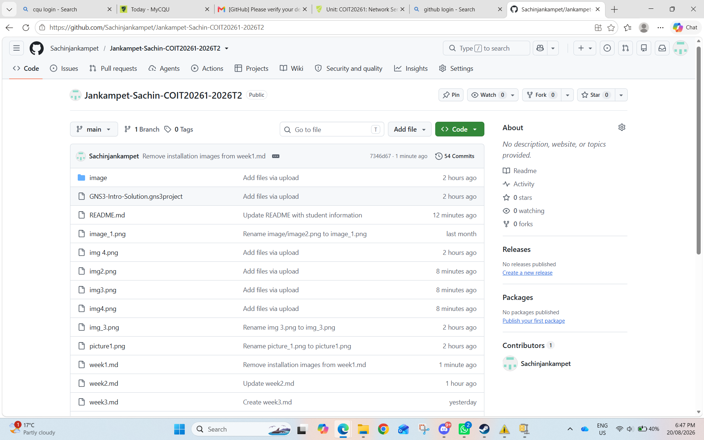

### Github repository

# TASK1

This screenshot shows me the GNS3 project with a Linux host and required project information and ip address is to create a basic GNS3 topology, add a host, and document the configuration

This image illustrates the Linux Console outputwhich displays the network interface details. Using the "ip address" command confirmed that ip address was assigned to the interface of the eth0 was 192.168.0.2/24 This enabled me to learn about verifying the IP address

## Individual Reflection

I Explored the GNS3 and gains a better understanding that of its command management options.

This activity helped me to learn how the virtual network swttings support a functional environment 

from this, i conclude that i become confident in navigating and working on the GNS3
