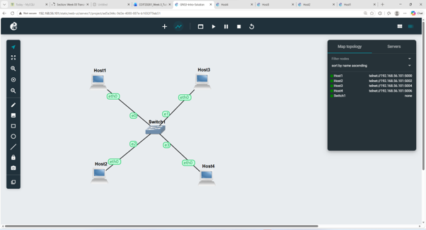
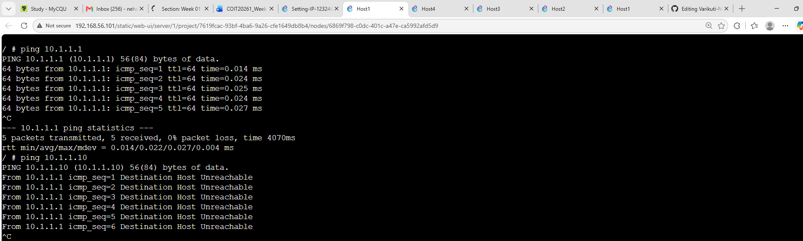

### Network Topology

### HOST1 IP ADDRESS

this screenshot shows the ip a output for the host1. the eth0 i/p has the ip address is 10.1.1.1/24 confirming successfully configured

### HOST2 IP ADDRESS

This screenshot shows the ip a output for the host2. the eth0 interface is configurd with 10.1.1.2/24 demonstrating that it has been assigned a form of unique ip address

### HOST3 IP ADDRESS

This screenshot shows the command used to edit is /etc/network/interfaces, restart the etho interface with ifdown and ifup

### HOST4 IP ADDRESS

# TASK 2: Testing Network Connectivity and Delay Ping

### ping to an unreachable ip address

This screenshot shows a ping test to an ip address its not an unreachable ip address the responses shows the demonstrating that the demonstration could not be reached. This helped me understand how ping can be used and verify whether a the device is reachable on a network

### ping to host1

This screenshot shows a successful ping test between two hosts on the same networkwhere the responses confirm that 0% packet loss and the round-trip time. also learned the how ping options are be used and observe their effect on the results

## Reflection

I used the ip a command to examine the network configuration for Host1.
This helped me to identify the loopback and the Ethernet interfaces, wich  including the IP address of 10.1.1.1.
The activity improved my understanding of how Linux displays interface information.
