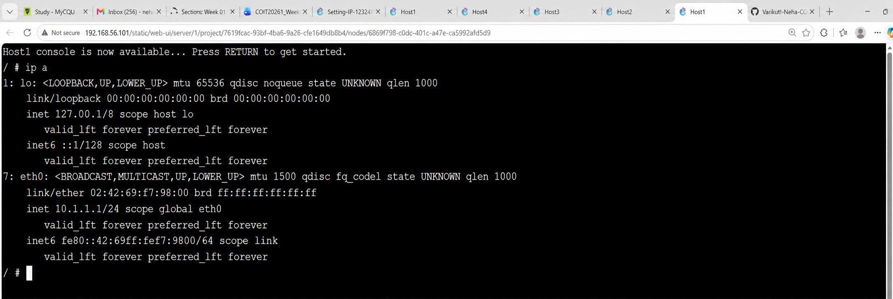
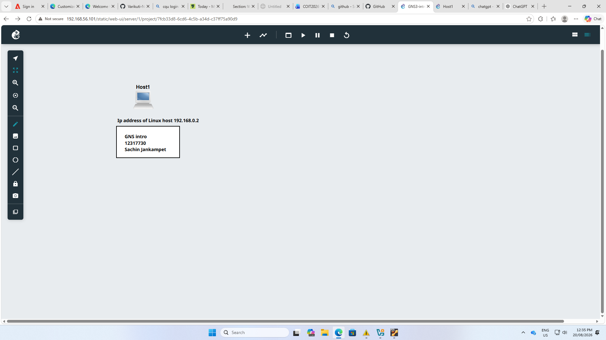
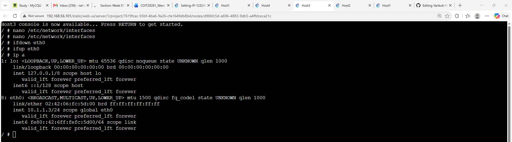
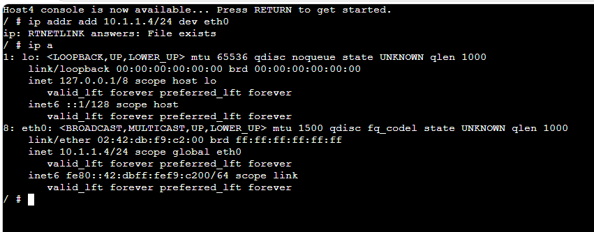
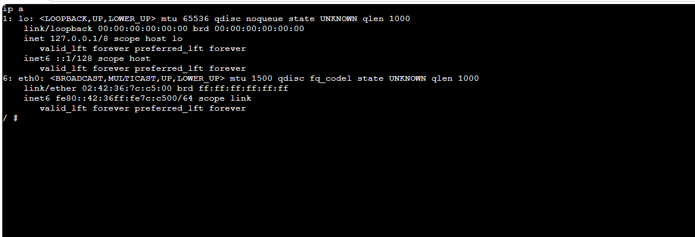

### Network Topology

### HOST1 IP ADDRESS

this screenshot shows the ip a output for the host1. the eth0 i/p has the ip address is 10.1.1.1/24 confirming successfully configured

### HOST2 IP ADDRESS

This screenshot shows the ip a output for the host2. the eth0 interface is configurd with 10.1.1.2/24 demonstrating that it has been assigned a form of unique ip address

### HOST3 IP ADDRESS

This screenshot shows the command used to edit is /etc/network/interfaces, restart the etho interface with ifdown and ifup

### HOST4 IP ADDRESS

