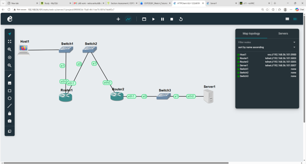
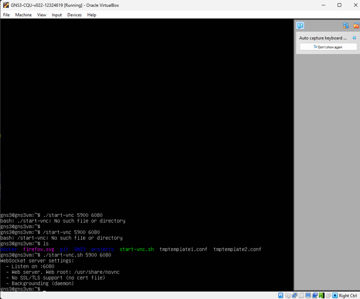
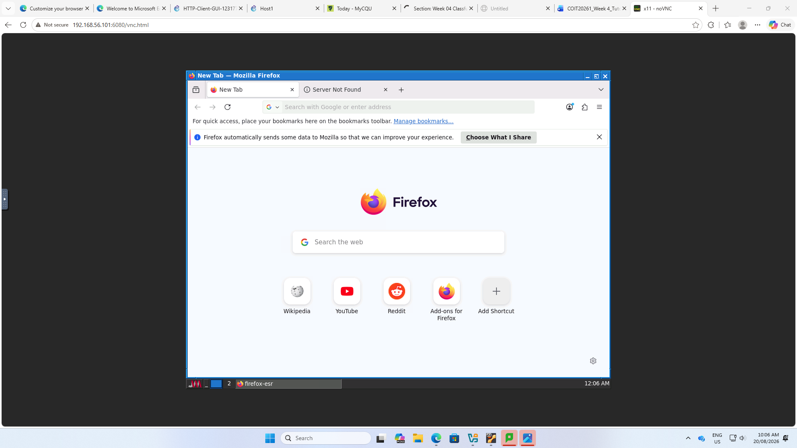
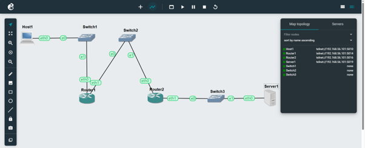
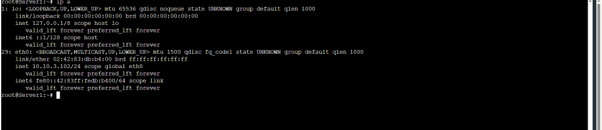
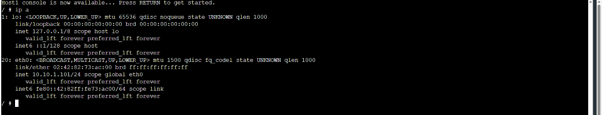
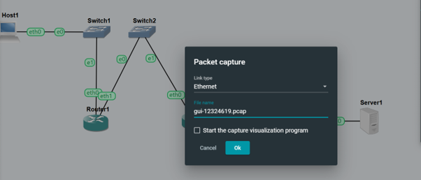
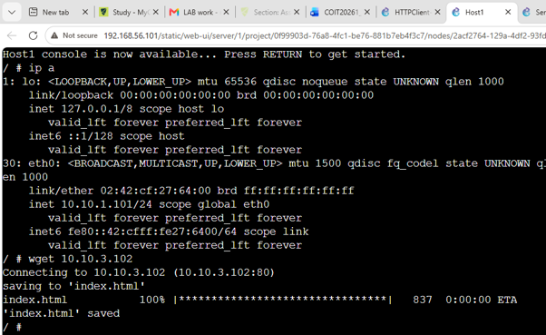
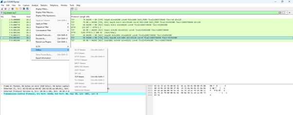
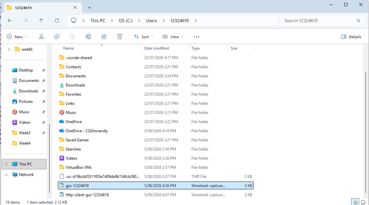

# Task 1 - HTTP Client with GUI
### Network Topolgy

This screenshot states the completed network topolgy of the HTTP GUI Client. network shows the firefox client, two routers, switches, and the Linux server connected and the Linux server connected to the three subnets. This demonstrates the network structure for communication between HTTP client and server

### GUI network topolgy

### firefox accessing the web server 

This screeenshot shows the firefox which Host1 successfully and accessing the web server  at 10.10.3.102 HTTP client was able to communicate with the HTTP server
through the network

This screenshot shows the packet capture being configured on the Ethernet link between the routers in subnet B . I selected the link and HTTP communication between the client and server 

### FileZilla

# Task 2 - HTTP Clientt with Command Line Interface

### CLI network Topology

### ip on Linux Host

### packet capture configuration

the screenshot it self shows the packet capture on link between the routers in subnet B. The packet was started so that HTTP traffic was generated by the command line client could be recorded

### wireshrk packet list

This screenshot shows the packet capture of the HTTP test opened in the wireshark

### .pcap file on windows

### HTTP response in the wireshark

